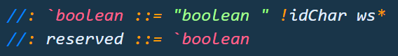
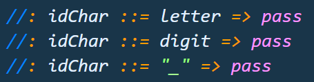

# vscode-wranglr 🤠

Syntax highlighting for writing WrangLR grammars in Java files using VS Code.

## Features

MiniJava keyword highlighting:
* Reserved words e.g. \`boolean, \`break...
* Reserved but unused words e.g. \`abstract, \`assert...
* Special-character tokens e.g. \`!, \`=...

WrangLR highlighting for:
* Operators e.g. `//:`, `::=`, `=>`...
* Repitition and optional symbols e.g. `A+`, `A**`, `A?`...
* Special semantic actions e.g. `void`, `text`, `pass`...

> Tip: Many popular extensions utilize animations. This is an excellent way to show off your extension! We recommend short, focused animations that are easy to follow.

## Setup

Install extension

Works out of the box when editing `.java` files.

## Known Issues

Please report issues within the GitHub issues section.
